# Tema 1. Arquitecturas paralelas: clasificación y prestaciones
## Lección 1. Clasificación del paralelismo implícito en una aplicación
### 1.1 Objetivos
- Clasificaciones del paralelismo implícito en una aplicación. Distinguir entre paralelismo de tareas y de datos.
- Distinguir entre dependencias RAW, WAW, WAR.
- Distinguir entre thread y proceso.
- Relacionar el paralelismo implícito en una aplicación con el nivel en el que se hace explícito para que se pueda utilizar (instrucción, thread, proceso) y con las arquitecturas paralelas que lo aprovechan.

### 1.2 Criterios de clasificaciones del paralelismo implícito en una aplicación.
- **Paralelismo funcional**.
      - **Nivel de funciones**. Las funciones llamadas en un programa se pueden ejecutar en paralelo, siempre que no haya entre ellas dependencias inevitables, como dependencias de datos verdaderas (lectura después de escritura).
      - **Nivel de bucle (bloques)**. Se pueden ejecutar en paralelo las iteraciones de un bucle, siempre que se eliminen los problemas derivados de dependencias verdaderas. Para detectar dependencias habrá que analizar las entradas y las salidas de las iteraciones del bucle.
      - **Nivel de operaciones**. Las operaciones independientes se pueden ejecutar en paralelo. En los procesadores de propósito específico y en los de propósito general podemos encontrar instrucciones compuestas de varias operaciones que se aplican en secuencia al mismo flujo de datos de entrada. Se pueden usar instrucciones compuestas, que van a evitar las penalizaciones por dependencias verdaderas.
- **Paralelismo de datos** (*data parallelism o DLP-Data Level Par.*). Se encuentra implícito en las operaciones con estructuras de datos (vectores y matrices). Se puede extraer de la representación matemática de la aplicación. Las operaciones vectoriales y matriciales engloban operaciones que se pueden realizar en paralelo. Por lo que el paralelismo de datos está relacionado con el paralelismo a nivel de bucle.
- **Paralelismo de tareas** (*task parallelism o TLP-Task Level Par.*). Se encuentra extrayendo la estructura lógica de funciones de una aplicación. Los bloques son funciones y se puede encontrar paralelismo entre las funciones.
- **Granularidad**. El grano más pequeño (*grano fino*) se asocia al paralelismo entre operaciones o instrucciones, el *grano medio* se asocia a los bloques funcionales lógicos y el *grano grueso* se asocia al paralelismo entre programas.


### 1.3 Dependencias de datos.
Para que un bloque de código $B_2$ presente dependencia de datos con respecto a $B_1$, deben hacer referencia a una misma posición de memoria M (variable) y $B_1$ aparece en la secuencia de código antes que $B_2$.

Tipos de dependencias de datos (de $B_2$ respecto a $B_1$):

- **RAW** (*Read After Write*) o dependencia verdadera.
- **WAW** (*Write After Write*) o dependencia de salida.
- **WAR** (*Write After Read*) o antidependencia.

``` c++
...
a = b + c
... //código que no usa a
d = a + c
...
```

``` c++
...
a = b + c
... //se lee a
a = d + e
... //se lee a
```

``` c++
...
b = a + 1
...
a = d + e
... //se lee a
```


### 1.4 Paralelismo implícito (nivel de detección), explícito y arquitecturas parlelas.
El paralelismo entre **programas** se utiliza a nivel de procesos. Cuando se ejecuta un programa, se crea el proceso asociado al programa.

El paralelismo entre **funciones** se puede extraer para utilizarlo a nivel de procesos o de hebras.

El paralelismo dentro de un **bucle** se puede extraer a nivel de procesos o de hebras. Se puede aumentar la granularidad asociando un mayor número de iteraciones del ciclo a cada unidad a ejecutar en paralelo. Se puede hacer explícito dentro de una instrucción vectorial para que sea aprovechado por arquitecturas SIMD o vectoriales.

El paralelismo entre **operaciones** se puede aprovechar en arquitecturas con paralelismo a nivel de instrucción (ILP) ejecutando en paralelo las instrucciones asociadas a estas operaciones independientes.

<p>

</p>


#### 1.4.1 Nivel de paralelismo explícito.
##### 1.4.1.1 Unidades en ejecución en un computador.
- **Instrucciones**. La unidad de control de un core o procesador gestiona la ejecución de instrucciones por la unidad de procesamiento.
- **Thread o light process**. Es la menor unidad de ejecución que gestiona el SO. Menor secuencia de instrucciones que se pueden ejecutar en paralelo o concurrentemente.
- **Proceso o process**. Mayor unidad de ejecución que gestiona el SO. Un proceso consta de uno o varios thread.

##### 1.4.1.2 Threads versus procesos.
$\newline$
El hardware gestiona la ejecución de las instrucciones. A nivel superior, el SO se encarga de gestionar la ejecución de unidades de mayor granularidad, procesos y hebras. Cada proceso en ejecución tiene su propia asignación de memoria. Los SO **multihebra** permiten que un proceso se componga de una o varias hebras (hilos). Una **hebra** tiene su propia pila y contenido de registros, entre ellos el puntero de pila y el IP (Puntero de Instrucciones) que almacena la dirección de la siguiente instrucción a ejecutar de la hebra, pero comparte el código, las variables globales y otros recursos con las hebras del mismo proceso. Por lo que las hebras se pueden crear y destruir en menor tiempo que los procesos, y la comunicación (se usa la memoria que comparten), sincronización y conmutación entre hebras de un proceso es más rápida que entre procesos. Luego las hebras tienen menor granularidad que los procesos.

Un **proceso** comprende el código del programa y todo lo que hace falta para su ejecución:

  - Datos en pila, segmentos (variables globales y estáticas) y en heap (BP1).
  - Contenido de los registros.
  - Tabla de páginas.
  - Tabla de ficheros abiertos.

Para comunicar procesos hay que usar llamadas al SO.

El paralelismo implícito en el código de una aplicación se puede hacer explícito a nivel de instrucciones, de hebras o de procesos.

<p>
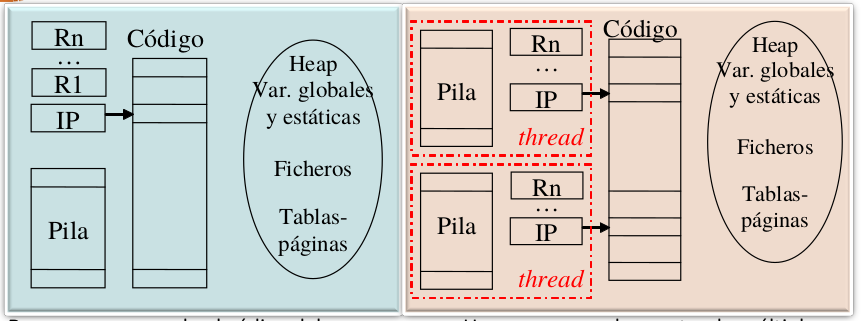
</p>

### 1.5 Detección, utilización, implementación y extracción del paralelismo.
En los procesadores ILP superescalares o segmentados la arquitectura extrae paralelismo. Para ello, eliminan dependencias de datos falsas entre instrucciones y evitan problemas debidos a dependencias de datos, de control y de recursos. La arquitectura extrae paralelismo implícito en las entradas en tiempo de ejecución (dinámicamente). El grado de paralelismo de las instrucciones aprovechado se puede incrementar con ayuda del compilador y del programador. Podemos definir el grado de paralelismo de un conjunto de entradas a un sistema como el máximo número de entradas del conjunto que se puede ejecutar en paralelo. Para los procesadores las entradas son instrucciones. En las arquitecturas ILP VLIW el paralelismo que se va a aprovechar está ya explícito en las entradas. Las instrucciones que se van a ejecutar en paralelo se captan juntas de memoria. El análisis de dependencias entre instrucciones en este caso es estático.

<p>

</p>

Hay compiladores que extraen el paralelismo de datos implícito a nivel de bucle. Algunos compiladores lo hacen explícito a nivel de hebra, y otros dentro de una instrucción para que se pueda aprovechar en arquitecturas SIMD o vectoriales. El usuario, como programador, puede extraer el paralelismo implícito en un bucle o entre funciones definiendo hebras y/o procesos. La distribución de las tareas independientes entre hebras o entre procesos dependerán de

- la granularidad de las unidades de código independientes,
- la posibilidad que ofrezca la herramienta para programación paralela disponible de definir hebras o procesos,
- la arquitectura disponible para aprovechar el paralelismo,
- el SO disponible.

Por último, los usuarios del sistema al ejecutar programas están creando procesos que se pueden ejecutar en el sistema concurrentemente o en paralelo.

## Lección 2. Clasificación de arquitecturas paralelas.

### 2.1 Objetivos
- Distinguir entre procesamiento o computación paralela y distribuida.
- Clasificar los computadores según segmento del mercado.
- Distinguir entre las diferentes clases de arquitecturas de la clasificación de Flynn.
- Diferenciar un multiprocesador de un multicomputador.
- Distinguir entre NUMA y SMP.
- Distinguir entre arquitecturas DLP, ILP, TLP.
- Distinguir entre arquitecturas TLP con una instancia de SO y TLP con varias instancias de SO.

### 2.2 Computación paralela y computación distribuida.
- **Computación paralela**. Estudia los aspectos hardware y software relacionados con el desarrollo y ejecución de aplicaciones en un sistema de cómputo compuesto por múltiples cores/procesadores/computadores que es visto externamente como una unidad autónoma (multicores, multiprocesadores, multicomputadores, cluster).
- **Computación distribuida**. Estudia los aspectos hardware y software relacionados con el desarrollo y ejecución de aplicaciones en un sistema distribuido; es decir, en una colección de recursos autónomos (PC, servidores -de datos, software, ...-, supercomputadores...) situados en distintas localizaciones físicas.
    - **Computación distribuida baja escala**. Estudia os aspectos relacionados con el desarrollo y ejecución de aplicaciones en una colección de recursos autónomos de un dominio administrativo situados en distintas localizaciones físicas conectados a través de infraestructura de red local.
    - **Computación distribuida gran escala**.
        - **Computación grid**. Estudia los aspectos relacionados con el desarrollo y ejecución de aplicaciones en una colección de recursos autónomos de múltiples dominios administrativos geográficamente distribuidos conectados con infraestructura de telecomunicaciones.
        - **Computación cloud**. Comprende los aspectos relacionados con el desarrollo y ejecución de aplicaciones en un sistema cloud. El sistema cloud ofrece servicios de infraestructura, plataforma y/o software, por los que se paga cuando se necesitan (pay-per-use) y a los que se accede típicamente a través de una interfaz (web) de auto-servicio. El sistema cloud consta de recursos virtuales que son una abstracción de los recursos físicos, parecen ilimitados en número y capacidad y son reclutados/liberados de forma inmediata sin interacción con el proveedor, soportan el acceso de múltiples clientes (multitenant) y están conectados con métodos estándar independientes de la plataforma de acceso.

### 2.3 Clasificaciones de arquitecturas y sistemas paralelos.
#### 2.3.1 Criterios de clasificación de computadores
- Comercial. Segmento del mercado: embebidos, servidores gama baja...

<p>

</p>

- Educación, investigación (también usados por fabricantes y vendedores):
    - Flujos de control y flujos de datos: clasificación de Flynn.
    - Sistemas de memoria.
    - Flujos de control (propuesta de clasificación de arquitecturas con múltiples flujos de control).
    - Nivel del paralelismo aprovechado (propuesta de clasificación).


#### 2.3.2 Clasificación de computadores según segmento
- **Externo** (*desktop, laptop, server, cluster...*) - R.EAC, IC.SCAP. Para todo tipo de aplicaciones:
    - Oficina, entretenimiento...
    - Procesamiento de transacciones o OLTP, sistemas de soporte de decisiones o DSS, e-comercio...
    - Científicas (medicina, biología, predicción del tiempo...) y animación (películas animadas, efectos especiales...).
- **Empotrado** (oculto) - IC.SCAE. Aplicaciones de propósito específico (videojuegos, teléfonos, coches, electrodomésticos...). Las restricciones típicas son: consumo de potencia, precio, tamaño reducido, tiempo real...

#### 2.3.3 Clasificación de computadores externos según segmento del mercado
$\newline$
<p>

</p>

#### 2.3.4 Clasificación de Flynn de arquitecturas (flujo instrucciones / flujo de datos)
$\newline$

<p>

</p>

- **Computadores SISD**. Un único flujo de instrucciones (SI) procesa operandos y genera resultados, definiendo un único flujo de datos (SD).

    Corresponde a los computadores uni-procesador, ya que existe una única unidad de control (UC) que recibe las instrucciones de memoria, las decodifica y genera los códigos que definen la operación correspondiente a cada instrucción que debe realizar la unidad de procesamiento (UP) de datos.

<p>

</p>

<p>

</p>

- **Computadores SIMD**. Un único flujo de instrucciones (SI) procesa operandos y genera resultados, definiendo varios flujos de datos (MD), dado que cada instrucción codifica realmente varias operaciones iguales, cada una actuando sobre operadores distintos.

    Los códigos que genera la única unidad de control a partir de cada instrucción actúan sobre varias unidades de procesamiento distintas (UPi). Por lo que se pueden realizar varias operaciones similares simultáneas con operandos distintos. Aprovechan paralelismo de datos.

<p>

</p>

<p>

</p>

<p>
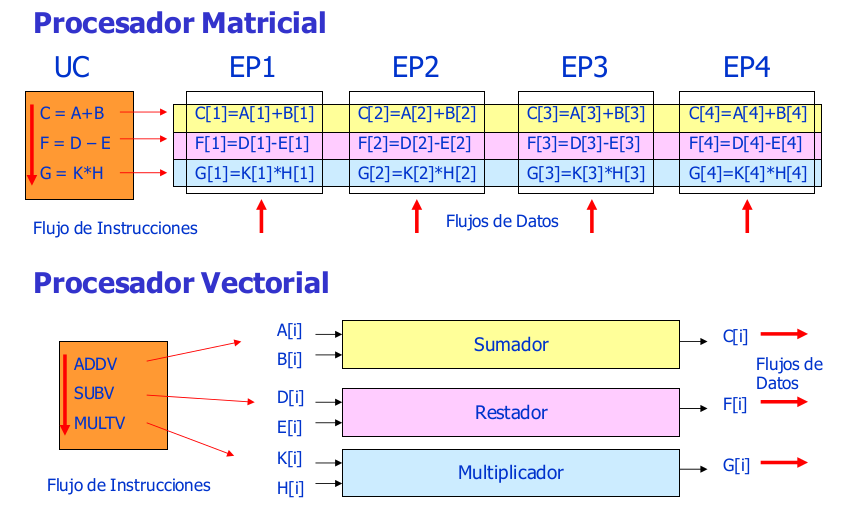
</p>

- **Computadores MIMD**. El computador ejecuta varias secuencias o flujos distintos de instrucciones (MI) y cada uno de ellos procesa operandos y genera resultados definiendo un único flujo de instrucciones, de forma que existen varios flujos de datos (MD) uno por cada flujo de instrucciones.

    Corresponde con multinúcleos, multiprocesadores y multicomputadores. Puede aprovechar paralelismo funcional. Existen varias unidades de control que decodifican las instrucciones correspondientes a distintos programas. Cada uno de estos programas procesa conjuntos de datos diferentes, que definen distintos flujos de datos.

<p>

</p>

- **Computadores MISD**. Se ejecutan varios flujos distintos de instrucciones (MI) aunque todos actúan sobre el mismo flujo de datos (SD).

    No existen computadores que funcionen según este modelo. Se puede simular en un código este modelo para aplicaciones que procesan una secuencia o flujo de datos.


#### 2.3.5 Sistemas de memoria
##### 2.3.5.1 Clasificación de computadores paralelos MIMD según el sistema de memoria
$\newline$
Los sistemas multiprocesadores se han clasificado atendiendo a la organización del sistema de memoria:

- **Sistemas con memoria compartida** (SM) o **multiprocesadores**. Son sistemas en los que todos los procesadores comparten el mismo espacio de direcciones. El programador no necesita conocer dónde están almacenados los datos.
- **Sistemas con memoria distribuida** (DM) o **multicomputadores**. Son sistemas en los que cada procesador tiene su propio espacio de direcciones particular. El programador necesita conocer dónde están almacenados los datos.

<p>

</p>

##### 2.3.5.2 Comparativa SMP (Symmetric MultiProcessor) y multicomputadores.
- **Multiprocesador con memoria centralizada (SMP)**. Es un multiprocesador en el que el tiempo de acceso de los procesadores a memoria es igual sea cual sea la posición de memoria a la que acceden, es una estructura simétrica.
    - Mayor latencia.
    - Poco escalable.
    - La comunicación es implícita mediante variables compartidas.
    - Los datos no están duplicados en memoria principal.
    - Necesita implementar primitivas de sincronización.
    - La distribución de código y datos entre procesadores no es necesaria.
    - La programación es más sencilla.
- **Multicomputador**.
    - Menor latencia.
    - Más escalable.
    - La comunicación es explícita mediante software para paso de mensajes (*send/receive*).
    - Los datos están duplicados en memoria principal y se copian datos entre módulos de memoria de diferentes procesadores.
    - La sincronización se hace mediante software de comunicación.
    - La distribución de código y datos entre procesadores es necesaria y se necesitan herramientas de programción más sofisticadas.
    - La programación es más difícil.

##### 2.3.5.3 Comunicación uno-a-uno en un multiprocesador.
$\newline$
Los diferentes procesadores que ejecutan una aplicación pueden requerir sincronizarse en algún momento. Por ejemplo, si el procesador A utiliza un dato que produce le procesador B, A deberá esperar a que B lo genere. En la siguiente imagen vemos la transferencia de datos en un multiprocesador. El proceso que ejecuta la instrucción de carga espera hasta recibir el contenido de la dirección. El proceso que ejecuta la instrucción de almacenamiento puede esperar a que termine para garantizar que se mantiene un orden en los accesos a memoria. Obsérvese que para que la transferencia de datos e realice de forma efectiva habría que sincronizar los procesos fuente y destino.

<p>

</p>

<p>
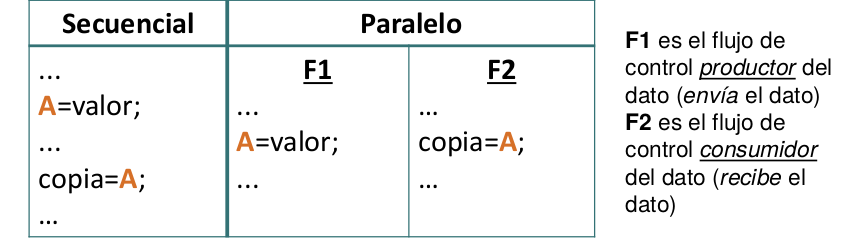
</p>

<p>
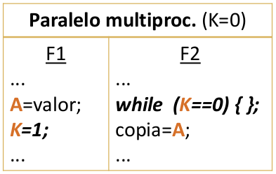
</p>

Se debe garantizar que el flujo de control **consumidor** del dato lea la variable compartida (A) cuando el **productor** haya escrito en la variable el dato.

En multicomputadores se aprovechan los mecanismos de comunicación para implementar sincronización. Con una función de recepción bloqueante, es decir, que deja al proceso que la ejecuta detenido hasta que se reciba el dato, se puede implementar sincronización. En la siguiente figura podemos ver la transferencia asíncrona (con función *receive* bloqueante) de datos en un multicomputador. EN transferencia asíncrona se requiere almacenamiento intermedio para evitar esperas. El proceso fuente continúa la ejecución en cuanto los datos se copien en un *buffer*. El destino espera en el *receive* bloqueante a que lleguen los datos, en caso de que estos no hayan llegado aún.

<p>

</p>

<p>
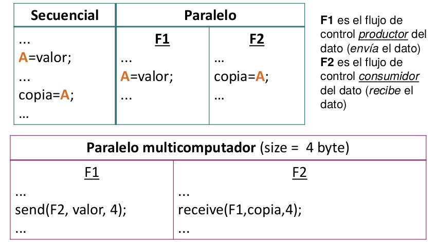
</p>

##### 2.3.5.4 Incremento de escalabilidad en multiprocesadores y red de interconexión.
$\newline$
Como los SMP tienen escasa escalabilidad, se ha intentado incrementar la escalabilidad en multiprocesadores:

- Aumentar caché del procesador.
- Usar redes de menor latencia y mayor ancho de banda que un bus (jerarquía de buses, barras cruzadas, multietapa).
- Distribuir físicamente los módulos de memoria entre los procesadores (pero se sigue compartiendo espacio de direcciones).

<p>

</p>

##### 2.3.5.5 Clasificación completa de computadores según el sistema de memoria.
- **Multiprocesadores**.
    - **UMA** (*Uniform Memory Access*).
        - **SMP**.
    - **NUMA** (*Non-Uniform Memory Access*).
        - **NUMA**. Arquitecturas con acceso a memoria no uniforme sin coherencia de caché entre nodos. No incorporan hardware para evitar problemas por incoherencias entre cachés de distintos nodos. Esto hace que los datos modificables compartidos no se puedan trasladar a caché de nodos remotos; hay que acceder a ellos individualmente a través de la red. Se puede hacer más tolerable la latencia utilizando precaptación (*prefetching*) de memoria y procesamiento multihebra.
        - **CC-NUMA**. Arquitecturas con acceso a memoria no uniforme y con caché coherente. Tienen hardware para mantener coherencia entre cachés de distintos nodos, que se encarga de las transferencias de datos compartidos entre nodos. El hardware para mantenimiento de coherencia supone un coste añadido e introduce un retardo que hace que estos sistemas escalen en menor grado que un NUMA.
        - **COMA**. Arquitecturas con acceso a memoria solo caché. La memoria local de los procesadores se gestiona como caché. El sistema de mantenimiento se encarga de llevar dinámicamente el código y los datos a los nodos donde se necesiten.

<p>

</p>

##### 2.3.5.6 Red en sistemas con memoria físicamente distribuida (NI: Network Interface).
$\newline$

<p>

</p>

Ejemplo: Red (con conmutador o switch) de barras cruzadas.

<p>

</p>

Ejemplo: Placa CC-NUMA con red estática

<p>

</p>

##### 2.3.6 Flujos de control (propuesta de clasificación de arquitecturas con múltiples flujos de control (o threads o flujos de instrucciones))
- **TLP** (*Thread Level Parallelism*). Ej. múltiples flujos de control concurrentemente o en paralelo.
    - **Implícito**. Flujos de control creados y gestionados por la arquitectura.
    - **Explícito**. Flujos de control creados y gestionados por el SO.
        - **Con una instancia SO**. Multiprocesadores, multicores, cores multithread...
        - **Con múltiples instancias SO**. Multicomputadores.

##### 2.3.7 Nivel del paralelismo aprovechado (propuesta de clasificación)
- **Arquitecturas con DLP** (*Data Level Parallelism*). Ejecutan las operaciones de una instrucción concurrentemente o en paralelo: unidades funcionales vectoriales o SIMD.
- **Arquitecturas con ILP** (*Instruction Level Parallelism*). Ejecutan múltiples instrucciones concurrentemente o en paralelo: cores escalares segmentados, superescalares o VLIW/EPIC.
- **Arquitecturas con TLP** (*Thread Level Parallelism*) explícito y una instancia de SO. Ejecutan múltiples flujos de control concurrentemente o en paralelo.
    - **Cores** que modifican la arquitectura escalar segmentada, superescalar o VLIW/EPIC para ejecutar threads concurrentemente o en paralelo.
    - **Multiprocesadores**: ejecutan threads en paralelo en un computador con múltiples cores (incluye multicores).
- **Arquitecturas con TLP** explícito y múltiples instancias SO. Ejecutan múltiples flujos de control en paralelo.
    - **Multicomputadores**: ejecutan threads en paralelo en un sistema con múltiples computadores.


### 2.4 Nota histórica
- **DLP** (*Data Level Parallelism*). Unidades funcionales (o de ejecución) SIMD (o multimedia).
- **ILP** (*Instruction Level Parallelism*).
    - Procesadores/cores segmentados.
    - Procesadores con múltiples unidades funcionales.
    - Procesadores/cores superescalares
    - Procesadores/cores VLIW
- **TLP** (*Thread Level Parallelism*).
    - TLP explícito con una instancia de SO.
        - Multithread grano fino (FGMT).
        - Multithread grano grueso (CGMT).
        - Multithread simultánea (SMT).
        - Multiprocesadores en un chip (CMP) o multicores.
        - Multiprocesadores.
    - TPL explícito con múltiples instancias del SO (multicomputadores): IC.SCAP.


## Lección 3. Evaluación de prestaciones.
### 3.1 Objetivos.
- Distinguir entre tiempo de CPU (sistema y usuario) de unix y tiempo de respuesta.
- Distinguir entre productividad y tiempo de respuesta.
- Obtener, de forma aproximada mediante cálculos, el tiempo de CPU, GFLOPS y los MIPS del código ejecutado en un núcleo de procesamiento.
- Explicar el concepto de ganancia en prestaciones.
- Aplicar la ley de Amdahl.

### 3.2 Medidas usuales para evaluar prestaciones.

#### 3.2.1 Tiempo de respuesta.
- Real (*wall-clock time, elapsed time, real time*).
- *CPU time = user + sys* (no incluye todo el tiempo).
- Con un flujo de control.
    - elapsed >= CPU time.

    ```
    time ./program.exe
    elapsed 5.4
    user 3.2
    sys 1.0
    ```
- Con múltiples flujos de control
    - elapsed < CPU time, elapsed >= CPU time/nº flujos control.

En el programa, `user 3.2` significa el tiempo de CPU de usuario (tiempo de ejecución en espacio de usuario). `sys 1.0` significa el tiempo de CPU de sistema (tiempo en el nivel del kernel del SO). Además, hay otro tiempo asociado a las esperas debidas a I/O o asociados a la ejecución de otros programas.

Comando time en Unix: 3.2u + 1.0s es el 78% del tiempo transcurrido (5.4).

Alternativas para obtener tiempos:

| Función | Fuente | Tipo | Resolución aprox. (microsegs)
| ---------- | ---------- | ---------- | ---------- |
| time   | SO (/usr/bin/time)  |  elapsed, user, system  | 10000 |
| clock()   | SO (time.h)  | CPU   | 10000  |
| gettimeofday()   | SO (sys/time.h) |  elapsed  |  1 |
| clock_gettime () / clock_getres()   | SO (time.h)  | elapsed   |  0.001 |
| omp_get_wtime() / omp_get_wtick()   |  OpenMP (omp.h) |  elapsed  |  0.001 |
| SYSTEM_CLOCK()   | Fortran  |  elapsed  | 1 |

<p>

</p>

$$TiempoDeCPU \; (T_{CPU}) = CiclosDelPrograma \cdot T_{CICLO} = \frac{CiclosDelPrograma}{FrecuenciaDeReloj}$$

$$Ciclos por Instrucción \; (CPI) = \frac{CiclosDelPrograma}{NumeroDeInstrucciones(NI)}$$

$$T_{CPU} = NI \cdot CPI \cdot T_{CICLO}$$

$$CiclosDelPrograma = \sum_{i=1}^n CPI_i \cdot I_i$$

$$CPI = \frac{\sum_{i=1}^n CPI_i \cdot I_i}{NI}$$

En el programa hay $I_i$ instrucciones del tipo i (i=1,...,n).

Cada instrucción del tipo i consume $CPI_i$ ciclos.

Hay n tipos de instrucciones distintos.

$$T_{CPU} = NI \cdot (CPE/IPE) \cdot T_{CICLO}$$

$$CPI = \frac{CPE}{IPE}$$

Hay procesadores que pueden lanzar para que empiecen a ejecutarse (emitir) varias instrucciones al mismo tiempo.

- **CPE**: Número mínimo de ciclos transcurridos entre los instantes en que el procesador puede emitir instrucciones
- **IPE**: Instrucciones que pueden emitirse (para empezar su ejecución) cada vez que se produce dicha emisión.

<p>

</p>

$$T_{CPU} = (Noper/OpInstr) \cdot CPI \cdot T_{CICLO}$$

$$NI = Noper/OpInstr$$

Hay procesadores que pueden codificar varias operaciones en una instrucción.

- **Noper**: Número de operaciones que realiza el programa
- **Op_instr**: Número de operaciones que puede codificar una instrucción.

<p>

</p>

<p>

</p>

#### 3.2.2 Productividad: MIPS, MFLOPS.
$\newline$
**MIPS**: millones de instrucciones por segundo.

$$MIPS = \frac{NI}{T_{CPU} \cdot 10^6} = \frac{F(frecuencia)}{CPI \cdot 10^6}$$

- Depende del repertorio de instrucciones (difícil la comparación de máquinas con repertorios distintos)
- Puede variar con el programa (no sirve para caracterizar la
máquina)
- Puede variar inversamente con las prestaciones (mayor valor de MIPS corresponde a peores prestaciones)


**MFLOPS**: millones de operaciones en coma flotante por
segundo.

$$MFLOPS = \frac{OperacionesEnComaFlotante}{T_{CPU} \cdot 10^6}$$

- No es una medida adecuada para todos los programas (sólo tiene en cuenta las operaciones en coma flotante del programa)
- El conjunto de operaciones en coma flotante no es constante en máquinas diferentes y la potencia de las operaciones en coma flotante no es igual para todas las operaciones (por ejemplo, con diferente precisión, no es igual una suma que una multiplicación..).
- Es necesaria una normalización de las instrucciones en coma flotante

<p>

</p>

### 3.3 Conjunto de programas de prueba (Benchmark).

- Propiedades exigidas a medidas de prestaciones:
    - Fiabilidad => Representativas, evaluar diferentes componentes del sistema y reproducibles.
    - Permitir comparar diferentes realizaciones de un sistema o diferentes sistemas => Aceptadas por todos los interesados (usuarios, fabricantes, vendedores).
- Interesados:
    - Vendedores y fabricantes de hardware o software.
    - Investigadores de hardware o software.
    - Compradores de hardware o software.
- Tipos de Benchmarks:
    - De bajo nivel o microbenchmark.
        - testping-pong, evaluación de las operaciones con enteros o con flotantes.
    - Kernels.
        - resolución de sistemas de ecuaciones, multiplicación de matrices, FFT, descomposición LU.
    - Sintéticos.
        - Dhrystone, Whetstone.
    - Programas reales.
        - SPEC CPU2006: enteros (gcc, gzip, perlbmk).
    - Aplicaciones diseñadas.
        - Predicción de tiempo, simulación de terremotos.

### 3.3.1 LINPACK.
El núcleo de este programa es una rutina denominada DAXPY (Double precision- real Alpha X Plus Y) que multiplica un vector por una constante y los suma a otro vector. Las prestaciones obtenidas se escalan con el valor de N (tamaño del vector):

```c++
for (i=0; i<N; i++)
  y[i] = alpha*x[i] + y[i];
```

<p>

</p>

### 3.4 Ganancia en prestaciones.

#### 3.4.1 Mejora o ganancia de prestaciones (speed-up o ganancia en velocidad).
$\newline$
Si en un computador se incrementan las prestaciones de un recurso haciendo que su velocidad sea p veces mayor (ejemplos: se utilizan p procesadores en lugar de uno, la ALU realiza las operaciones en un tiempo p veces menor...):

El incremento de velocidad que se consigue en la nueva situación con respecto a la previa (máquina base) se expresa mediante la ganancia de velocidad o speed-up, $S_p$

$$S_p = \frac{V_p}{V_1} = \frac{T_1}{T_p}$$

donde

$V_1$: velocidad de la máquina base.

$V_p$: velocidad de la máquina mejorada (un factor p en uno de sus componentes).

$T_1$: tiempo de ejecución en la máquina base.

$T_P$: tiempo de ejecución en la máquina mejorada.

Si se incrementan las prestaciones de un sistema, el incremento en prestaciones (velocidad) que se consigue en la nueva situación, p, con respecto a la previa (sistema base, b) se expresa mediante la ganancia en prestaciones o speed-up, S

$$S = \frac{V_p}{V_b} = \frac{T_b}{T_p}$$

$$S = \frac{T_{CPU}^b}{T_{CPU}^p} = \frac{NI^b \cdot CPI^b \cdot T_{CICLO}^b}{NI^p \cdot CPI^p \cdot T_{ciclo}^p}$$

donde

$V_b$: velocidad de la máquina base.

$V_p$: velocidad de la máquina mejorada (un factor p en uno de sus componentes).

$T_b$: tiempo de ejecución en la máquina base.

$T_P$: tiempo de ejecución en la máquina mejorada.


Mejora en un núcleo de procesamiento: segmentación.

<p>

</p>

Mejora en un núcleo de procesamiento: operación superescalar.

<p>
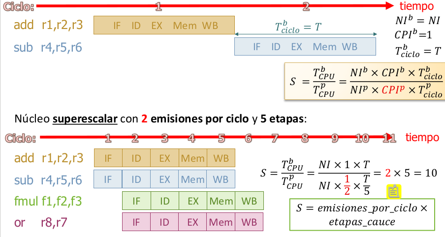
</p>

Mejora en un núcleo de procesamiento: unidades funcionales SIMD.

<p>

</p>

¿Qué impide que se pueda obtener la ganancia en velocidad pico?

- Riesgos:
    - Datos.
    - Control.
    - Estructurales.
- Accesos a memoria (debido a la jerarquía).


Riesgos de datos y control:

<p>
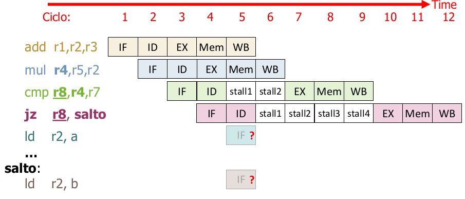
</p>

<p>
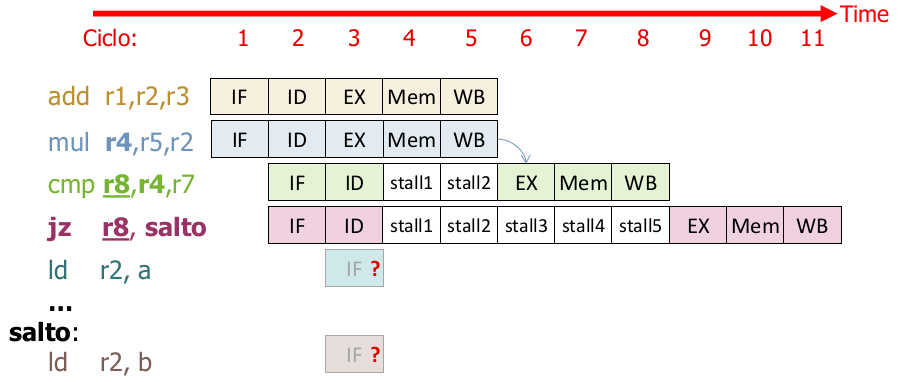
</p>

Riesgos de datos, control y estructural:

<p>

</p>

#### 3.4.2 Ley de Amdahl.
$\newline$
La mejora de velocidad, S, que se puede obtener cuando se mejora un recurso de una máquina en un factor p está limitada por:

$$S = \frac{V_p}{V_b} = \frac{T_b}{T_p} \leq \frac{1}{f + \frac{1-f}{p}} = \frac{p}{1+f(p-1)}$$

Si $p \rightarrow \infty$, entonces $\frac{p}{1+f(p-1)} \rightarrow 1/f$.

Si $f \rightarrow 0$, entonces $\frac{p}{1+f(p-1)} \rightarrow p$.

donde f es la fracción del tiempo de ejecución en la máquina sin la mejora durante el que no se puede aplicar esa mejora.

Ejemplo: Si un programa pasa un 25% de su tiempo de ejecución en una máquina realizando instrucciones de coma flotante, y se mejora la máquina haciendo que estas instrucciones se ejecuten en la mitad de tiempo, entonces p=2; f=0.75.

S $\leq$ 2/(1+0.75)=1.14

S = $\frac{T_b}{T_p} = \frac{1}{0.75+\frac{0.25}{2}} = 1.14$

Hay que mejorar el caso más frecuente (lo que más se usa)

Ley enunciada por Amdahl en relación con la eficacia de los computadores paralelos: dado que en un programa hay código secuencial que no puede paralelizarse, los procesadores no se podrían utilizar eficazmente.

$\pagebreak$

# Tema 2. Programación paralela
## Lección 4. Herramientas, estilos y estructuras en programación paralela.

### Objetivos.

- Distinguir entre los diferentes tipos de herramientas de programación paralela: compiladores paralelos, lenguajes paralelos, API Directivas y API de funciones.
- Distinguir entre los diferentes tipos de comunicaciones colectivas.
- Diferenciar el estilo/paradigma de programación de paso de mensajes del de variables compartidas.
- Diferenciar entre OpenMP y MPI en cuanto a su estilo de programación y tipo de herramienta.
- Distinguir entre las estructuras de tareas/procesos/treads master-slave, cliente-servidor, descomposición de dominio, flujo de datos o segmentación, y divide y vencerás.

### 4.1 Problemas que plantea la programación paralela al programador. Punto de partida.

#### 4.1.1 Problemas que plantea la programación paralela al programador.

$\newline$
Nuevos problemas, respecto a programación secuencial:

- División en unidades de cómputo independientes (tareas).
- Agrupación/asignación de tareas o carga de trabajo (códigos, datos) en procesos/threads.
- Asignación a procesadores/núcleos.
- Sincronización y comunicación.

Los debe abordar la herramienta de programación o el programador o SO.
$\newline$
<p>

</p>

#### 4.1.2 Punto de partida.
$\newline$
El punto de partida es:

- partir de una versión secuencial.
- descripción o definición de la aplicación.

Se apoya en:

- Programa paralelo que resuelva un problema parecido.
- Versiones paralelas u optimizadas de bibliotecas de funciones: BLAS (*Basic Linear Algebra Subroutine*), LAPCK (*Linear Algebra PACKage*)...

#### 4.1.3 Modos de programación MIMD.

- SPMD (*Single-Program Multiple Data*).

<p>

</p>

- MPMD (*Multiple-Program Multiple Data*).

<p>

</p>

### 4.2 Herramientas para obtener código paralelo.

<p>

</p>

- Las herramientas permiten de forma implícita o explícita (lo hace el programador):
    - Localizar paralelismo o descomponen en tareas independientes (*decomposition*).
    - Asignar -as tareas, es decir, la carga de trabajo (código + datos), a procesos/threads (*scheduling*).
    - Crear y terminar procesos/threads (o enrolar y desenrolar en un grupo).
    - Comunicar y sincronizar procesos/threads.
- El programador, la herramienta o el SO se encarga de asignar procesos/threads a unidades de procesamiento (*mapping*).

Ejemplo: cálculo de PI con OpenMP/C.

<p>
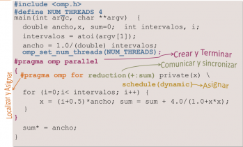
</p>

reduction: tiene que sumar todas las variables `sum` y las guarda en `sum`.


Ejemplo: cálculo de PI en MPI/C.

<p>
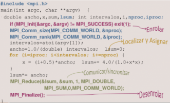
</p>

Hemos modificado el bucle `for` para repartir el trabajo entre los procesos.

#### 4.2.1 Comunicaciones colectivas.
$\newline$

<p>

</p>


#### 4.2.2 Comunicación uno-a-todos.
$\newline$

<p>
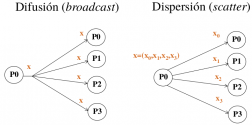
</p>

#### 4.2.3 Comunicación todos-a-uno.
$\newline$

<p>
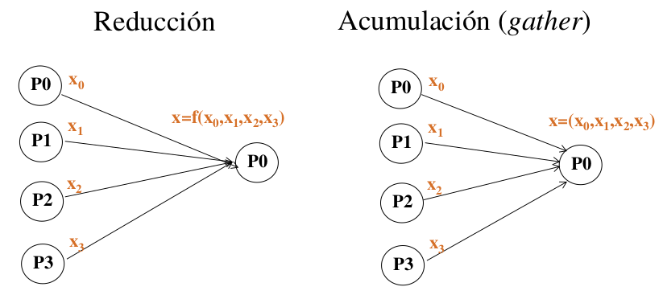
</p>

En la reducción, lo que envían todos los procesos se reduce a un único valor, aplicando conmutativa y asociativa. En acumulación se aplican los valores tal cual.

#### 4.2.4 Comunicación múltiple uno-a-uno.
$\newline$

<p>
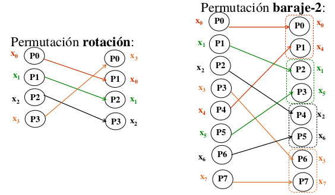
</p>

#### 4.2.5 Comunicación todos-a-todos.
$\newline$

<p>

</p>

$\pagebreak$

#### 4.2.6 Servicios compuestos.
$\newline$

<p>

</p>

En la desviación típica:

$$ s = \sqrt{\frac{\sum_{i=1}^N (x_i-media)^2}{N-1}} $$

Se haría un todo reduce.

<p>
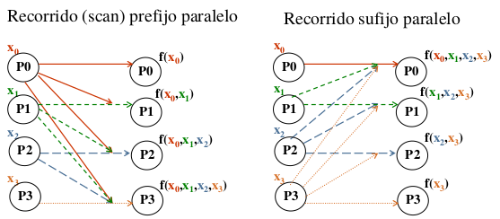
</p>

Ejemplo: comunicación colectiva en OpenMP.

<p>

</p>

Ejemplo: comunicación en MPI.

<p>

</p>


### 4.3 Estilos/paradigmas de programación paralela.

#### 4.3.1 Estilos de programación y arquitecturas paralelas.
- Paso de mensajes: también se puede usar en multiprocesadores.
- Paralelismo de datos: se corresponde con la arquitectura SIMD.

<p>

</p>

#### 4.3.2 Estilos de programación y herramientas de programación.

- Paso de mensajes (*message passing*).
    - Lenguajes de programación: Ada, Occam.
    - API (Bibliotecas de funciones): MPI, PVM.
- Variables compartidas (*shared memory, shared variables*).
    - Lenguajes de programación: Ada, Java.
    - API (directivas del compilador + funciones): OpenMP.
    - API (Bibliotecas de funciones): POSIX Threads, shmem, Intel TBB.
- Paralelismo de datos (*data parallelism*).
    - Lenguajes de programación + funciones: HPF (High Performance Fortran), Fortran 95 (forall, operaciones con matrices/vectores), Nvidia CUDA.
    - API (directivas del compilador + funciones - stream processing): OpenACC.

### 4.4 Estructuras típicas de códigos paralelos.

#### 4.4.1 Estructuras típicas de procesos/threads/tareas.

Estructuras típicas de procesos/threads en código paralelo:

- Descomposición de dominio o descomposición de datos cliente/servidor.
- Divide y vencerás o descomposición recursiva.
- Segmentación o flujo de datos.
- Master-Slave, o granja de tareas.

#### 4.4.2 Master-Slave o granja de tareas.
>Las tareas se representan con un círculo.
>Los arcos representan flujo de datos.

Tenemos un flujo de instrucciones que se encarga de repartir el trabajo entre esclavos y recolecta resultados. Los esclavos están ejecutando el mismo código. El máster puede hacer un trabajo distinto. Luego combinamos un MPMD con SPMP.

<p>

</p>


#### 4.4.3 Cliente-Servidor.
$\newline$

<p>

</p>

#### 4.4.4 Descomposición de dominio o descomposición de datos.
$\newline$
Hay comunicación entre parejas de flujos de instrucciones.

- Se pueden representar con matrices

- Aplicación: inundaciones, software metereológico...

<p>

</p>


Ejemplo: filtrado imagen.

<p>

</p>

$\pagebreak$

#### 4.4.5 Estructura segmentada o de flujo de datos.
$\newline$
Necesitamos que en la aplicación se aplique a una un flujo de entrada en secuencia una serie de operaciones, una detrás de otra. Ejemplo: MP3, MP4, multimedia...

En el caso de JPEG, los bloques se dividen en 8x8 bloques y se decodifica en el orden que indiquen las flechas. No puedo aplicar descomposición de dominio porque hay dependencia de bloques.

Podemos paralelizar una sola etapa, cuando se encuentren distintas estructuras en etapas.

<p>

</p>

#### 4.4.6 Divide y vencerás o descomposición recursiva.

Tareas en forma de árbol. Aplicación: para resolver un problema cuya solución se puede realizar dividiéndolo en subproblemas.

Los arcos representan flujo de datos. (flechas negras).
Agrupación/Asignación de tareas a flujos de instrucciones. (flechas negras).

En la imagen, usaríamos 4 flujos de datos como máximo porque el grado de paralelismo es 4. Las flechas naranjas representan la asignación de flujos de instrucciones.

<p>

</p>


> Ejersisio:  29 marzo
>>>>calculo de la covarianza:
descomposicion de dominio.(paralelismo de datos)
>>>y la ordenación por mezcla implementar en OPENMP paralelizarlo
tener en cuenta que es divide y venceras.

## Lección 5. Proceso de paralelización.

### 5.1 Objetivos.

- Programar en paralelo una aplicación sencilla.
- Distinguir entre asignación estática y dinámica (ventajas e inconvenientes).

### 5.2 Proceso de paralelización.

- Descomponer en tareas independientes.
    - Análisis de dependencia entre funciones.
    - Análisis de dependencia entre iteraciones de bucles.

    <p>
    
    </p>

    - Ejemplo de cálculo PI: descomposición en tareas independientes.

    Se puede paralelizar pi fácilmente.

    $$ \pi = 4\int_0^1 frac{1}{1+x^2} = 4 \sum_i base \cdot altura_i , i = 0,1,...$$

    $altura = \frac{1}{1+x^2}$, $x_i = (i+0'5)1/int$

    <p>
    
    </p>

    En la siguiente imagen,

    <p>
    
    </p>

- Asignar (planificar+mapear) tareas a procesos y/o threads.
    - Ejemplo: filtrado de imagen.

    <p>
    
    </p>

    - Incluimos: agrupación de tareas en procesos/threads (scheduling) y mapeo a procesadores/cores (mapping).
    - La granularidad de la carga de trabajo (tareas) asignada a los procesos/threads depende de:
        - número de cores o procesadores o elementos de procesamiento.
        - tiempo de comunicación/sincronización frente a tiempo de cálculo.
    - Equilibrado de la carga (tareas = código + datos) o load balancing:
        - Objetivo: unos procesos/threads no deben hacer esperar a otros.
    - ¿De qué depende el equilibrado?
        - La arquitectura:
            - homogénea frente a la heterogénea.
            - uniforme frente a no uniforme.
        - La aplicación/descomposición.
    - Tipos de asignación:
        - Estática.
            - Está determinado qué tarea va a realizar cada procesador o core.
            - Explícita: programador.
            - Implícita: herramienta de programación al generar el código ejecutable.
        - Dinámica (en tiempo de ejecución).
            - Distintas ejecuciones pueden asignar distintas tareas a un procesador o core.
            - Explícita: el programador.
            - Implícita: herramienta de programación al generar el código ejecutable.
    - Mapeo de procesos/threads a unidades de procesamiento.
        - Normalmente se deja al SO el mapeo de threads (light process).
        - Lo puede hacer el entorno o sistema en tiempo de ejecución (runtime system de la herramienta de programación).
        - El programador puede influir.

    - Ejemplo: filtrado de  imagen.

    <p>
    
    </p>

    - Códigos filtrado por imagen.

      Descomposición por columnas.

    ```c
    #include <omp.h>
    ...
    omp_set_num_threads(M)
    #pragma omp parallel private(i) {
          for (i=0;i<N;i++) {
              #pragma omp for
              for (j=0;j<M;j++) {
                  pS[i,j] = 0,75*p[i,j] + 0,0625*(p[i-1,j]+p[i,j-1]
                            + p[i+1,j]+ p[i,j+1]);
              }
          }
     }
      ...
    ```

      Descomposición por filas.

    ```c
      #include <omp.h>
      ...
      omp_set_num_threads(N)
      #pragma omp parallel private(j) {
          #pragma omp for
          for (i=0;i<N;i++) {
              for (j=0;j<M;j++) {
                  pS[i,j] = 0,75*p[i,j] + 0,0625*(p[i-1,j]+p[i,j-1]+ p[i+1,j]+ p[i,j+1]);
              }
          }
      }
      ...
    ```

      - Ejemplo de asignación estática del paralelismo de tareas y datos con OpenMP.

      <p>
      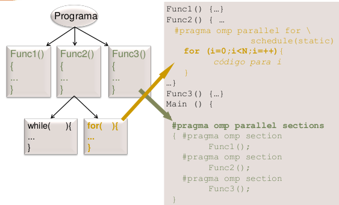
      </p>

      - Asignación estática.
          - Asignación estática y explícita de las iteraciones de un bucle.

          <p>
          
          </p>

      - Asignación dinámica.
          - Asignación dinámica y explícita de las iteraciones de un bucle.

          <p>
          
          </p>

          - Dinámica e implícita.
      - Asignación. Ejemplo: multiplicación matriz por vector.
          <p>
          
          </p>

- Redactar código paralelo.
    - Ejemplo: cálculo de PI con OpenMP/C.

      Con la clausula de planificación, estamos haciendo la carga dinámica.

      <p>
      
      </p>

    - Asignación de tareas a 2 threads estática por turno rotatorio.

      <p>
      
      </p>

    - Ejemplo: cálculo de PI en MPI/C.

      <p>
      
      </p>

- Evaluar prestaciones. Para ver la bondad, es decir, para ver si hemos hecho un buen código.


## Lección 6. Evaluación de prestaciones en procesamiento paralelo.

### Objetivos.

- Obtener ganancia y escalabilidad en el contexto de procesamiento paralela
- Aplicar la ley de Amdahl en el contexto de procesamiento paralela
- Comparar la ley de Amdahl y ganancia escalable.

### 6.1 Ganancia de prestaciones y escalabilidad.

#### 6.1.1 Evaluación de prestaciones.

- Medidas usuales.
    - Tiempo de respuesta.
        - Real (wall-clock time, elapsed time) (/usr/bin/time).
        - Usuario, sistema, CPU time = user + sys.
    - Productividad.
- Escalabilidad.
- Eficiencia.
    - Relación prestaciones/prestaciones máximas.
    - Rendimiento = prestaciones/no_recursos.
    - Otras: Prestaciones/consumo_potencia, prestaciones/área_ocupada.

#### 6.1.2 Ganancia en prestaciones. Escalabilidad.
$\newline$
Ganancia de prestaciones = $S(p) = \frac{Prestaciones(p)}{Prestaciones{l}} = \frac{T_s}{T_p(p)}$

Ganancia en velocidad (Speedup)

- Ganancia máxima de la eficiencia = 1
- Ganancia mínima de la eficiencia = 1/p

$$T_p(p) = \frac{T_s}{p} \rightarrow S(p)= T_s / T_p(p) = \frac{T_s}{T_s/p} = p$$

- Sobrecarga (*overhead*):
    - Comunicación/sincronización.
    - Crear/terminar procesos/threads.
    - Cálculos o funciones no presentes en versión secuencial.
    - Falta de equilibrado.

$$E(p) = \frac{Prest(p)}{PrestMax(p)}=\frac{Prest(p)}{p\cdot Prest(l)}=\frac{S(p)}{p}$$

<p>

</p>

<p>

</p>

- Número de procesadores óptimo:

$$S(p) = \frac{T_S}{T_P(p)} = \frac{T_S}{T_C(p)+T_O(p)} = \frac{1}{f+\frac{1-f}{p} + \frac{T_O(p)}{T_S}}$$

$$T_C(p) = O(\frac{1}{p})$$

$$T_O(p) = O(p)$$

<p>
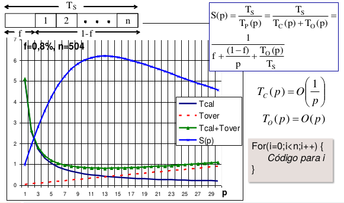
</p>

### 6.2 Ley de Amdahl.
- Ley de Amdahl: la ganancia en prestaciones utilizando $p$ procesadores está limitada por la fracción de código que no se puede paralelizar.

$$S(p) = \frac{T_S}{T_P(p)} \leq \frac{T_S}{f\cdot T_S + \frac{(1-f)T_S}{p}} = \frac{p}{1+f(p-1)} \rightarrow \frac{1}{f} (p \rightarrow \infty)$$

- S: incremento en velocidad que se consigue al aplicar una mejora. (paralelismo)
- p: Incremento en velocidad máximo que se puede conseguir si se aplica la mejora todo el tiempo. (número de procesadores)
- f: fracción de tiempo en el que no se puede aplicar la
mejora. (fracción de t. no paralelizable)

<p>
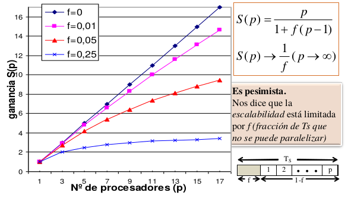
</p>


### 6.3 Ganancia escalable.

<p>

</p>

<p>
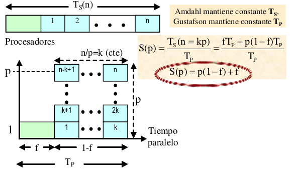
</p>


# Bibliografía

Ortega, M. Anguita, A. Prieto. Arquitectura de
Computadores, Thomson, 2005.
